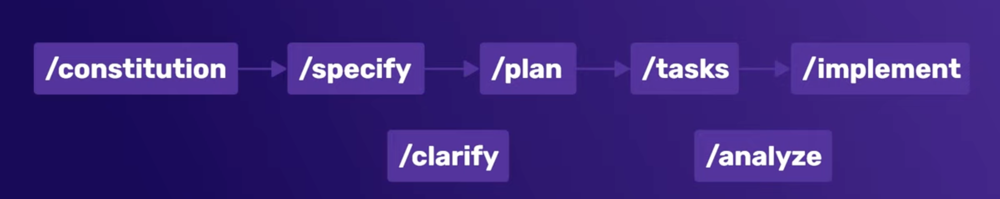
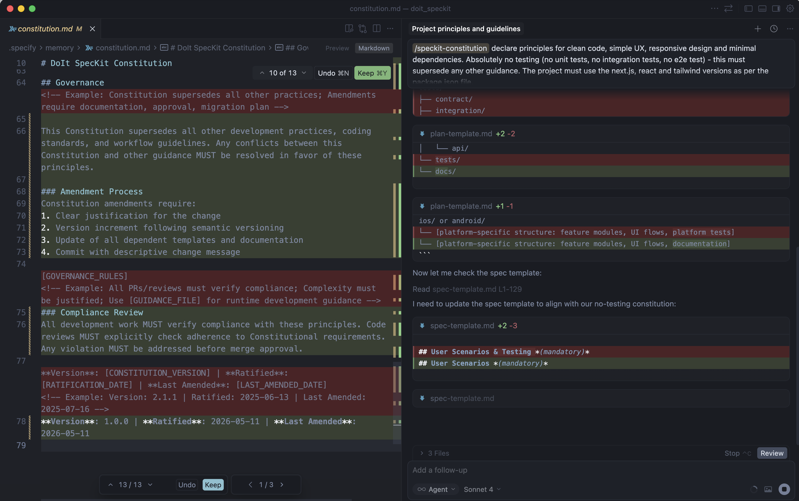
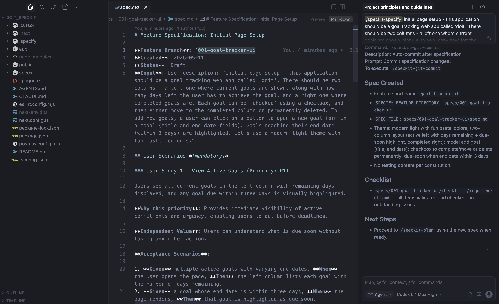
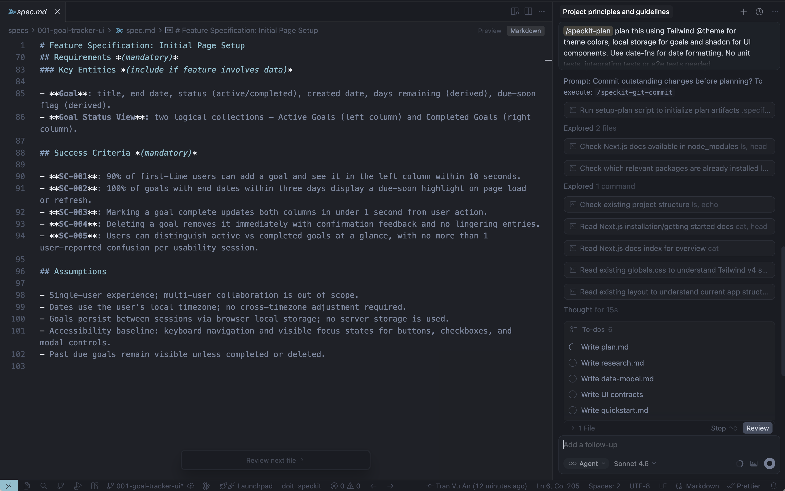
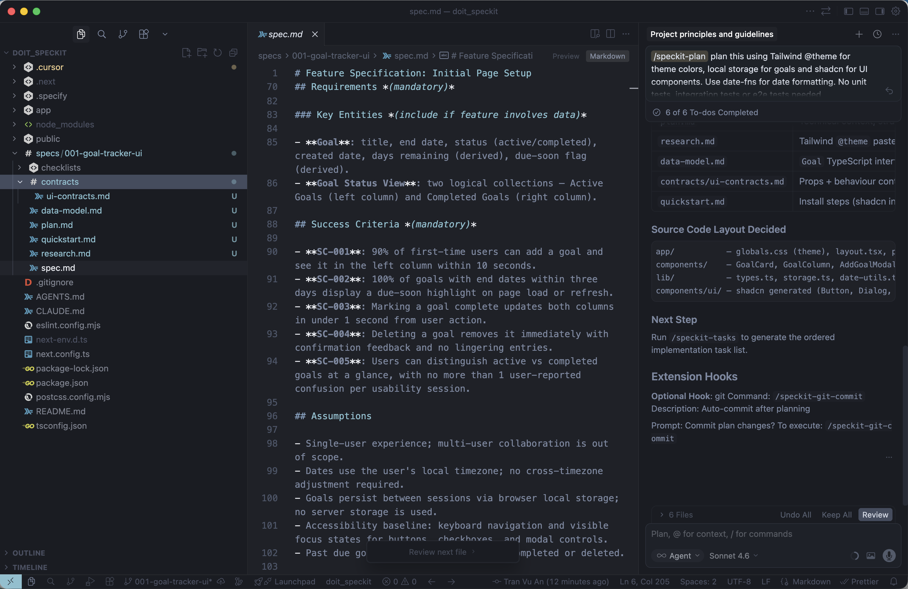
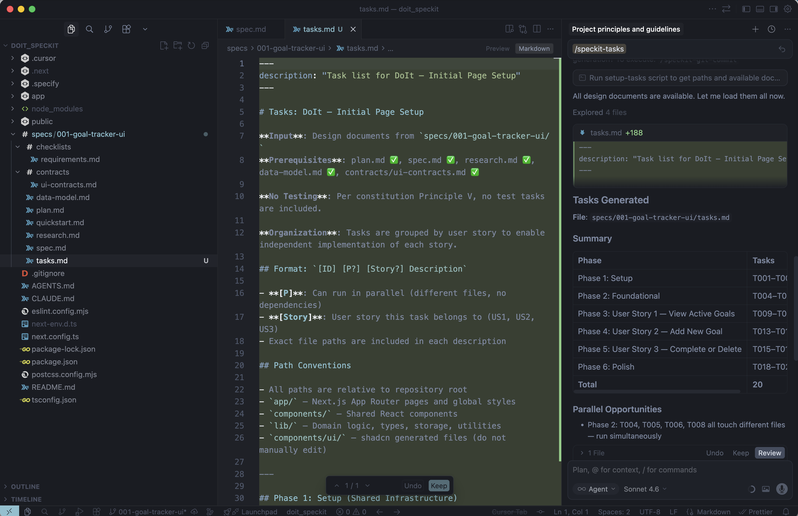
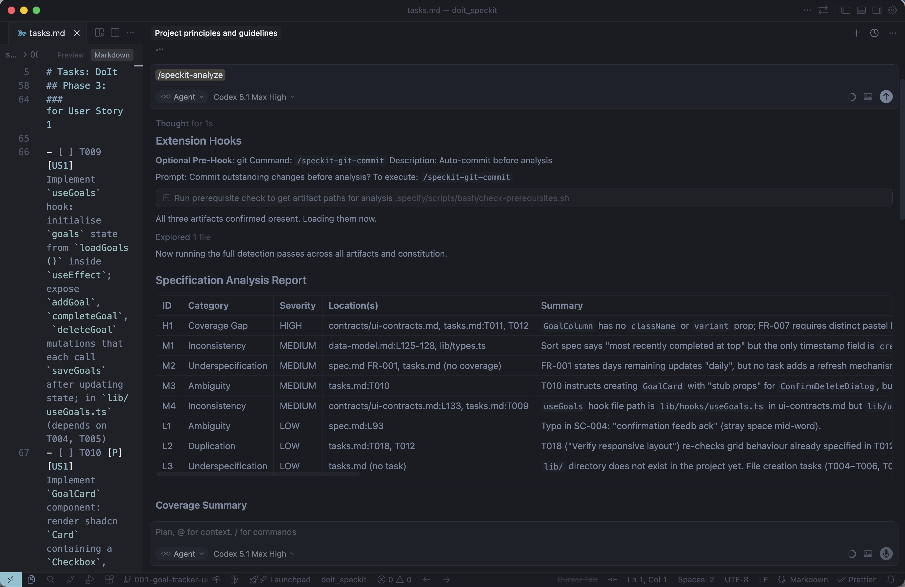
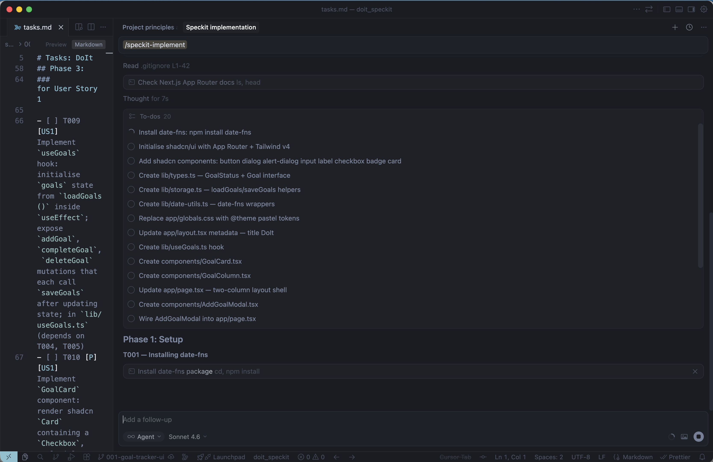
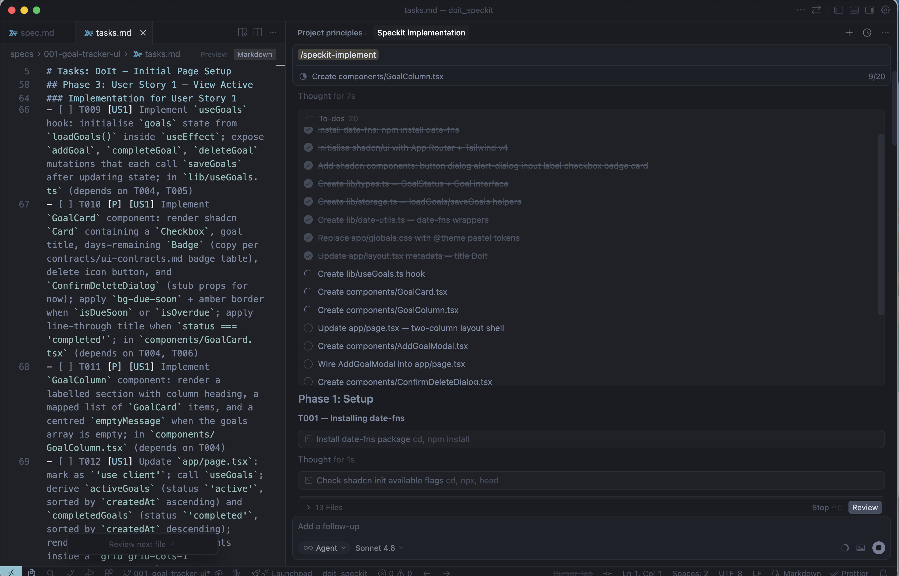

This is a [Next.js](https://nextjs.org) project bootstrapped with [`create-next-app`](https://nextjs.org/docs/app/api-reference/cli/create-next-app).
`$ npx create-next-app@latest`

## Getting Started

First, run the development server:

```bash
npm run dev
# or
yarn dev
# or
pnpm dev
# or
bun dev
```

Open [http://localhost:3000](http://localhost:3000) with your browser to see the result.

## Spec Driven Development flow with Spec-kit

### Instalation
At the time of writing, latest version is v0.8.7
```
uv tool install specify-cli --from git+https://github.com/github/spec-kit.git@v0.8.7
```

### Use specify to init spec-kit in this Doit root folder
```
specify init --here
# then choose your agent, ex: claude-code, cursor-agent, ...
```

# SpecKit Workflow Notes

## 1. Flow

```text
/constitution -> [ /specify -> /plan -> /tasks -> /implement ]
                        /clarify            /analyze
```



---

## 2. `/constitution`

### Purpose

Defines the core principles and boundaries for the coding agent.

This constitution file acts as persistent guidance or “memory” for future commands, ensuring the AI remains within the defined constraints and architecture.

> We basically build walls around the application and force the agent to stay within those boundaries at all times.

---

### Prompt

```text
/speckit-constitution declare principles for clean code, simple UX, responsive design and minimal dependencies. Absolutely no testing (no unit tests, no integration tests, no e2e test) - this must supersede any other guidance. The project must use the next.js, react and tailwind versions as per the package.json file.
```



---

## 3. `/specify`

### Purpose

Define one feature or spec at a time instead of generating the entire application in one shot.

This helps prevent the AI from:

* Veering off track
* Adding unnecessary functionality
* Implementing things incorrectly

---

### Prompt

```text
/speckit-specify initial page setup - this application should be a goal tracking web app called 'doit'. There should be two columns - a left one where current goals are shown, along with how many days left the user has to achieve the goal, and a right one where completed goals are. Each goal can be 'checked' using a checkbox, and then either move to the completed column or permanently deleted. To add new goals, a user can click on a button to open a new goal form in a modal (title and end date fields). Goals reaching their end date (within 3 days) are highlighted. Let's use a modern light theme with fun pastel colours.
```



---

## 4. `/clarify`

### Purpose

Reviews the generated spec to identify anything that is under-specified or ambiguous.

---

### Prompt

```text
/speckit-clarify
```

Choose option.

---

## 5. `/plan`

### Purpose

Transforms the high-level specification into a more technical implementation outline.

At this stage:

* The **spec** defines *what* to build
* The **plan** defines *how* to build it

---

### Prompt

```text
/speckit-plan plan this using Tailwind @theme for theme colors, local storage for goals and shadcn for UI components. Use date-fns for date formatting. No unit tests, integration tests or e2e tests needed
```





---

## 6. `/tasks`

### Purpose

Converts the implementation plan into a sequence of actionable development tasks.

---

### Prompt

```text
/speckit-tasks
```



---

## 7. `/analyze`

### Purpose

Performs a final review of everything generated so far before implementation begins.

This helps verify that:

* The specification is complete
* The plan is sound
* The tasks are actionable
* The AI is ready to implement

---

### Prompt

```text
/speckit-analyze
```



---

## 8. `/implement`

### Purpose

Implements the feature based on all previous stages.

At this point:

* The spec exists
* The technical plan exists
* The tasks are defined
* The implementation is ready

Because the context window may become large and bloated over time, it can help to start a fresh chat before implementation so the AI can focus more effectively.

---

### Prompt

```text
/speckit-implement
```





---

## 9. Run Demo

Using SpecKit and its staged workflow:

* Specification
* Clarification
* Planning
* Task generation
* Analysis
* Implementation

...helps keep the AI model significantly more focused and consistent.

Without SpecKit, even for relatively simple projects, it is common to repeatedly return to the AI asking:

* “Can you change this?”
* “Can you do this differently?”
* Reverting changes
* Scrapping implementations and restarting

Using these structured stages keeps the implementation much more aligned with the intended feature.

---

# Repeat the Cycle for New Features

After completing one feature, repeat the workflow again for the next feature.

## Example Next Feature

```text
The goals can be reordered by dragging and dropping up and down
```

## Prompts sequence

+ Specify
```
/speckit-specify drag and drop - let's make it so that users can reorder goals by draggning and dropping them above and below other goals in the list
```

+ Clarify
```
/speckit-clarify
```

+ Plan
```
/speckit-plan Plan this using the sortable library for sorting list items and Tailwind for styling. No testing whatsoever.
```

+ Tasks
```
/speckit-tasks
```

+ Implement
```
/speckit-implement
```

+ Done and rerun demo (npm run dev)

## References

[Spec-kit tutorial youtube playlist](https://www.youtube.com/watch?v=61K-2VRaC6s&list=PL4cUxeGkcC9h9RbDpG8ZModUzwy45tLjb&index=1)